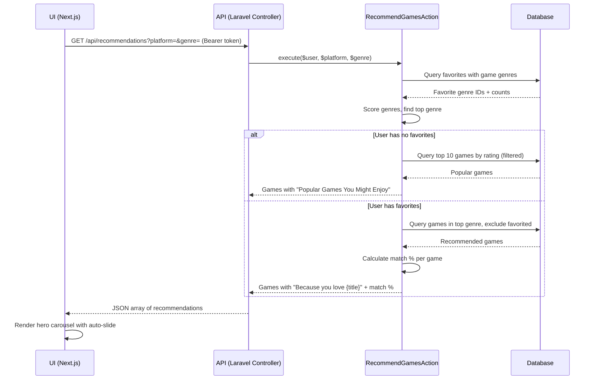

# Platform Implementation Documentation

## Overview

A full-stack game discovery platform built with **Laravel** (backend API) and **Next.js** (frontend). Users can browse games, write reviews, favorite games, get personalized recommendations, and follow other users.

---

## Recommendation System

### How It Works

The recommendation engine is implemented as a Laravel Action class (`RecommendGamesAction`) to keep business logic out of controllers.

**Scoring strategy — favorites-based:**

1. All of the user's favorited games are loaded with their genres.
2. Genres are counted: the more favorited games in a genre, the higher its score.
3. The top-scoring genre is used to query un-favorited games ordered by rating.
4. Each returned game gets a **match percentage** calculated as `(game genre score / total genre score) * 100`.

**Filtering:**

The action accepts optional `platform` and `genre` query parameters. When provided, results are filtered to that platform or genre before scoring. This allows the frontend to let users narrow recommendations in real time.

**Cold start:**

If a user has no favorites, the system returns the 10 highest-rated games in the database (optionally filtered by platform/genre) with the explanation `"Popular Games You Might Enjoy"`.

**Explanation strings:**

- `"Because you love {game title}"` — personalized, based on a favorited game in the top genre
- `"Popular Games You Might Enjoy"` — cold start or fallback

### Recommendation Carousel (Frontend)

The `Recommendations` component renders a full-width hero carousel:

- Auto-slides every 5 seconds
- Left/right arrow buttons appear on hover
- Dot indicators for manual navigation
- Displays: background image, genres, title, rating, explanation, match % badge
- Passes active `platform` and `genre` filters from the sidebar as props, re-fetching when they change
- Falls back to top-rated games via `/api/games` if the user is not logged in or the API returns nothing

### API Endpoint

```
GET /api/recommendations?platform={id}&genre={id}
Authorization: Bearer {token}
```

---

## Follow System

### Backend

- **`follows` table**: `follower_id`, `following_id` with a unique constraint to prevent duplicate follows.
- **`Follow` model**: belongs to `User` via `follower_id` and `following_id`.
- **`User` model**: `followers()` and `following()` relationships via `Follow`.
- **`FollowController`**:
  - `POST /api/users/{id}/follow` — follow a user
  - `DELETE /api/users/{id}/follow` — unfollow a user
  - `GET /api/users/search?q=` — search users by name (public, no auth required)
  - `GET /api/users/{id}/public` — return a user's public profile with follower/following counts and `is_following` flag for the authenticated user

### Frontend

- **User search dropdown** in the Navbar: searches users by name, shows avatar and name, links to their public profile.
- **Public profile page** (`/users/[id]`): displays avatar, bio, followers/following counts, and a follow/unfollow button. Shows "Edit Profile" link when viewing your own profile.

---

## User Profiles

### Bio

A `bio` text column (nullable, max 300 chars) was added to the `users` table. It is editable via `PUT /api/profile` and displayed on public profile pages.

### Profile Stats

```
GET /api/profile/stats
Authorization: Bearer {token}
```

Returns `followers_count` and `following_count` for the authenticated user.

### User Reviews (Public)

```
GET /api/users/{userId}/reviews
Authorization: Bearer {token}
```

Returns all reviews written by a given user, with the associated game.

### Profile Picture

Profile pictures are uploaded as base64 strings, decoded server-side, and stored in `storage/app/public/profile_pictures/`. The public URL is saved on the user record.

---

## Email Subscription

Users receive weekly recommendation emails. An `unsubscribed` boolean column on the `users` table controls opt-out.

- `GET /api/unsubscribe/{userId}` — sets `unsubscribed = true`
- `GET /api/subscribe/{userId}` — sets `unsubscribed = false`

---

## Database Indexes

Indexes were added to the `games` table to speed up common sort/filter operations:

| Column         | Purpose                                   |
| -------------- | ----------------------------------------- |
| `rating`       | Order by rating (recommendations, browse) |
| `release_date` | Order by release date                     |
| `title`        | Search/filter by title                    |

---

## API Route Summary

### Public

| Method | Endpoint                      | Description                        |
| ------ | ----------------------------- | ---------------------------------- |
| GET    | `/api/games`                  | List games (paginated, filterable) |
| GET    | `/api/games/{id}`             | Game detail                        |
| GET    | `/api/games/{id}/similar`     | Similar games                      |
| GET    | `/api/games/{gameId}/reviews` | Reviews for a game                 |
| POST   | `/api/register`               | Register                           |
| POST   | `/api/login`                  | Login                              |
| GET    | `/api/users/search?q=`        | Search users by name               |
| GET    | `/api/users/{id}/public`      | Public user profile                |
| GET    | `/api/unsubscribe/{userId}`   | Unsubscribe from emails            |
| GET    | `/api/subscribe/{userId}`     | Re-subscribe to emails             |

### Authenticated (Bearer token)

| Method | Endpoint                      | Description                      |
| ------ | ----------------------------- | -------------------------------- |
| POST   | `/api/logout`                 | Logout                           |
| PUT    | `/api/profile`                | Update name, email, bio          |
| POST   | `/api/profile/picture`        | Update profile picture           |
| GET    | `/api/profile/stats`          | Get follower/following counts    |
| GET    | `/api/users/{userId}/reviews` | Get a user's reviews             |
| GET    | `/api/favorites`              | List favorites                   |
| POST   | `/api/favorites`              | Add favorite                     |
| DELETE | `/api/favorites/{game_id}`    | Remove favorite                  |
| POST   | `/api/reviews`                | Create review                    |
| PUT    | `/api/reviews/{id}`           | Update review                    |
| DELETE | `/api/reviews/{id}`           | Delete review                    |
| GET    | `/api/recommendations`        | Get personalized recommendations |
| POST   | `/api/users/{id}/follow`      | Follow a user                    |
| DELETE | `/api/users/{id}/follow`      | Unfollow a user                  |

---

## Sequence Diagram — Recommendations


